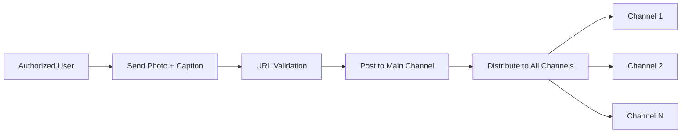

## Overview

The auto-posting system is the core feature of TeraBox Auto. It automatically distributes content from authorized users to all managed channels with proper formatting, URL validation, and inline buttons.

## Message flow architecture



## Photo message handler

The main auto-posting logic is triggered when authorized users send photos:

```python app.py
@bot.message_handler(func=lambda message:True,chat_id=[5507466970,1958848922], content_types=['photo'])
def command_default(m):
  photo_id = m.photo[-1].file_id
  OcaptionTitle = m.caption.split("\n")[0]
  TeraUrl = ""
  try:
    match = re.findall(r'(https?://[^\s]+)', f"{m.caption}")
    for url in match:
      data = url.split("/")[2]
      if str(data) in ValidDomain:
        TeraUrl+=url
        break
      else:
        continue
  except Exception as e:
    print(e)
  keyboard = types.InlineKeyboardMarkup()
  btn3 = types.InlineKeyboardButton(text=" ❤️Watch Online ", url=GENERALCHANNEL)
  keyboard.add(btn3)
  FData = PostText.format(OcaptionTitle,TeraUrl,TeraUrl,GENERALCHANNEL)
  msgy = bot.send_photo(chat_id=int(POSTCHANNEL),photo=photo_id,caption=FData,reply_markup=keyboard,parse_mode="html")
  try:
    ChnlList = GetAllChannel()
    for vii in ChnlList:
      try:
        bot.send_photo(chat_id=int(vii),photo=photo_id,caption=FData,reply_markup=keyboard,parse_mode="html")
      except Exception as e:
        bot.send_message(m.chat.id,f"rr {e}")
        pass
    bot.reply_to(m,"Done❤️")
    time.sleep(2)
  except Exception as e:
    Xxx = sys.exc_info()
    Yyy = traceback.format_exc()
    bot.send_message(m.chat.id,Xxx)
    bot.send_message(m.chat.id,Yyy)
```

### Authorized users

Only specific user IDs can trigger auto-posting:

```python app.py
chat_id=[5507466970,1958848922]
```

<Info>
These IDs correspond to the `AuthUser` list defined in `config.py`.
</Info>

## Content extraction

### Photo processing

The system extracts the highest quality photo from the message:

```python
photo_id = m.photo[-1].file_id
```

The `-1` index selects the largest resolution available.

### Caption parsing

The first line of the caption becomes the title:

```python
OcaptionTitle = m.caption.split("\n")[0]
```

### URL extraction and validation

The system uses regex to find URLs and validates them against the ValidDomain list:

```python
match = re.findall(r'(https?://[^\s]+)', f"{m.caption}")
for url in match:
  data = url.split("/")[2]
  if str(data) in ValidDomain:
    TeraUrl+=url
    break
```

<Note>
Only the first valid TeraBox URL is used. Invalid URLs are skipped.
</Note>

## Post formatting

The final post uses a custom template defined in `config.py`:

```python config.py
PostText ="""<b>{}🥰
  
{}
{}
  
🛑Login to watch full video🛑
━━━━━━━━━━━━━━━━━━━━━
✅ ᴊᴏɪɴ ɴᴏᴡ ꜰᴏʀ ᴍᴏʀᴇ ᴠɪᴅᴇᴏꜱ!
{}
  </b>"""
```

The template accepts 4 parameters:
1. **Title** - First line of caption
2. **URL (first instance)** - TeraBox link
3. **URL (second instance)** - Duplicate for emphasis
4. **General channel link** - Main community channel

### HTML formatting

Posts use Telegram's HTML parse mode:

```python
parse_mode="html"
```

Supported tags:
- `<b>` - Bold text
- `<a href=''>` - Hyperlinks

## Inline keyboard buttons

Each post includes an inline button:

```python
keyboard = types.InlineKeyboardMarkup()
btn3 = types.InlineKeyboardButton(text=" ❤️Watch Online ", url=GENERALCHANNEL)
keyboard.add(btn3)
```

The button links to the general channel defined in config:

```python config.py
GENERALCHANNEL = "https://t.me/+qTEbmFdW9U5hZTFl"
```

## Distribution process

### Step 1: Post to main channel

```python
msgy = bot.send_photo(chat_id=int(POSTCHANNEL),photo=photo_id,caption=FData,reply_markup=keyboard,parse_mode="html")
```

The main channel ID is retrieved from Google Sheets:

```python DetaDatabase.py
def GetPostChannelId():
    Id = "-100" + str(general.get("B2").first())
    return int(Id)
```

### Step 2: Distribute to all channels

```python
ChnlList = GetAllChannel()
for vii in ChnlList:
  try:
    bot.send_photo(chat_id=int(vii),photo=photo_id,caption=FData,reply_markup=keyboard,parse_mode="html")
  except Exception as e:
    bot.send_message(m.chat.id,f"rr {e}")
    pass
```

<Warning>
Failed channel posts are caught and reported but don't stop the distribution to other channels.
</Warning>

## Random post distribution

The system can also distribute random historical posts:

```python app.py
@bot.message_handler(commands=['random'])
def randomPosts(m):
  h = GetLastPostId()
  ChnlList = GetAllChannel()
  x = random.sample(range(2,int(h)), 10)
  yyy = 0
  for xt in x:
    for i in ChnlList:
      bot.forward_message(chat_id =i, from_chat_id = POSTCHANNEL, message_id = xt)
      time.sleep(2)
    yyy+=1
    bot.send_message(m.chat.id,f"{yyy}/10")
```

### How it works

<Steps>
  <Step title="Get last post ID">
    Retrieves the latest message ID from Google Sheets
  </Step>
  <Step title="Generate random IDs">
    Creates 10 random message IDs between 2 and the last post ID
  </Step>
  <Step title="Forward messages">
    Forwards each random post to all channels with 2-second delays
  </Step>
  <Step title="Progress updates">
    Sends progress messages (1/10, 2/10, etc.) to the command issuer
  </Step>
</Steps>

## New member greeting

When new members join a channel, they receive a random post:

```python app.py
@bot.message_handler(content_types=["new_chat_members"])
def new_member(message: types.Message):
  try:
    h = GetLastPostId()
    pstid = random.randint(2,int(h))
    bot.forward_message(chat_id = message.chat.id, from_chat_id = POSTCHANNEL, message_id = pstid)
  except Exception as e:
    Yyy = traceback.format_exc()
    bot.send_message(chat_id=699412278,text=Yyy)
```

## Error handling

### Distribution errors

If posting to a specific channel fails:

```python
except Exception as e:
  bot.send_message(m.chat.id,f"rr {e}")
  pass
```

The error is reported to the authorized user but doesn't interrupt distribution.

### Complete failures

If the entire process fails:

```python
except Exception as e:
  Xxx = sys.exc_info()
  Yyy = traceback.format_exc()
  bot.send_message(m.chat.id,Xxx)
  bot.send_message(m.chat.id,Yyy)
```

Full stack traces are sent to the authorized user for debugging.

## Rate limiting

The system includes delays to avoid Telegram rate limits:

```python
time.sleep(2)
```

<Tip>
The 2-second delay between posts helps prevent flood limits from Telegram's API.
</Tip>

## Best practices

<AccordionGroup>
  <Accordion title="Always include a TeraBox URL">
    The system expects at least one valid TeraBox URL in the caption. Posts without valid URLs will have an empty link field.
  </Accordion>
  
  <Accordion title="Use clear titles">
    The first line of your caption becomes the post title. Make it descriptive and engaging.
  </Accordion>
  
  <Accordion title="Monitor error messages">
    Pay attention to error notifications to identify channels with permission issues.
  </Accordion>
  
  <Accordion title="Test with single channel first">
    Before adding multiple channels, test the posting flow with one channel to ensure formatting is correct.
  </Accordion>
</AccordionGroup>