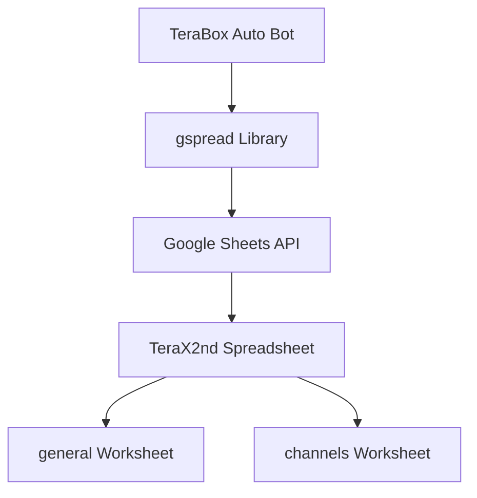

## Overview

TeraBox Auto uses Google Sheets as its primary database, eliminating the need for traditional database servers. This approach provides easy manual editing, real-time updates, and zero infrastructure costs.

## Architecture



## Setup and authentication

### OAuth2 service account

The system uses Google service account credentials:

```python DetaDatabase.py
from oauth2client.service_account import ServiceAccountCredentials

scope = ["https://spreadsheets.google.com/feeds",
         'https://www.googleapis.com/auth/spreadsheets',
         "https://www.googleapis.com/auth/drive.file",
         "https://www.googleapis.com/auth/drive"]
creds = ServiceAccountCredentials.from_json_keyfile_name("Badnaamchora2784.json", scope)
```

### Required scopes

<CardGroup cols={2}>
  <Card title="Spreadsheets (feeds)" icon="table">
    Legacy API access for Google Sheets
  </Card>
  <Card title="Spreadsheets (v4)" icon="table-cells">
    Modern Sheets API for read/write operations
  </Card>
  <Card title="Drive (file)" icon="file">
    Access to specific files in Google Drive
  </Card>
  <Card title="Drive (full)" icon="folder">
    Complete Drive access for file management
  </Card>
</CardGroup>

### Connection initialization

```python DetaDatabase.py
client = gspread.authorize(creds)
ak = client.open("TeraX2nd")
general = ak.worksheet("general")
channels = ak.worksheet("channels")
```

## Worksheet structure

### General worksheet

The `general` worksheet stores system-wide configuration:

| Cell | Purpose | Example Value |
|------|---------|---------------|
| B1 | Last post message ID | 1234 |
| B2 | Post channel ID (without -100 prefix) | 2191085367 |

### Channels worksheet

The `channels` worksheet maintains the channel list:

| Column A | Column B |
|----------|----------|
| Row number | Channel ID |
| 1 | -1001234567890 |
| 2 | -1009876543210 |
| ... | ... |

<Info>
Cell A51 stores the current row counter for adding new channels.
</Info>

## Database functions

### User authorization

```python DetaDatabase.py
def CheckAuthUser(UserId):
    if int(UserId) in AuthUser:
        return True
    else:
        None
```

This function checks if a user ID exists in the authorized users list from `config.py`:

```python config.py
AuthUser = [5507466970,1958848922]
```

### Channel management

#### Adding channels

```python DetaDatabase.py
def AddChannel(ChnlId):
  cells = channels.findall(str(ChnlId))
  if len(cells) > 0:
    return True
  else:
    h = channels.get('A51').first()
    h1 = int(h) + 1
    channels.update_cell(int(h1),1 ,f"{h1}")
    channels.update_cell(int(h1),2 ,ChnlId)
```

<Steps>
  <Step title="Check for duplicates">
    Searches the entire worksheet for the channel ID
  </Step>
  <Step title="Get next row number">
    Reads the counter from cell A51 and increments it
  </Step>
  <Step title="Write row number">
    Updates column A with the row index
  </Step>
  <Step title="Write channel ID">
    Updates column B with the channel ID
  </Step>
</Steps>

#### Retrieving all channels

```python DetaDatabase.py
def GetAllChannel():
    values_list = channels.col_values(2)
    return values_list
```

This function returns all values from column B (column index 2) as a list.

<Warning>
The returned list includes the header row if present. Filter out non-numeric values when using this function.
</Warning>

### Post tracking

#### Updating last post ID

```python DetaDatabase.py
def UpdateTotalPost(msgid):
    general.update("B1",msgid)
```

This stores the message ID of the latest post in cell B1 of the general worksheet.

#### Getting last post ID

```python DetaDatabase.py
def GetLastPostId():
    h = general.get('B1').first()
    return h
```

Retrieves the stored message ID for use in random post selection.

### Channel configuration

#### Getting post channel ID

```python DetaDatabase.py
def GetPostChannelId():
    Id = "-100" + str(general.get("B2").first())
    return int(Id)
```

This function:
1. Reads the channel ID suffix from cell B2
2. Prepends "-100" to create a valid Telegram supergroup ID
3. Converts to integer for bot API usage

<Note>
Telegram supergroup IDs always start with -100 followed by the channel's numeric ID.
</Note>

### Placeholder functions

```python DetaDatabase.py
def UpdateAdTextMsgId(ID):
    print("123")
```

This function is defined but not implemented. It's reserved for future ad text tracking.

## Usage in main application

The functions are imported and used throughout `app.py`:

```python app.py
from DetaDatabase import AddChannel,GetAllChannel,CheckAuthUser,UpdateTotalPost,GetLastPostId,UpdateAdTextMsgId,GetPostChannelId

POSTCHANNEL = GetPostChannelId()
```

### Authorization check

```python app.py
@bot.message_handler(commands=['start'])
def send_welcome(m):
  if CheckAuthUser(m.chat.id) == True:
    bot.reply_to(m,"Runnung..")
  else:
    bot.reply_to(m,"you are not authrise")
```

### Channel retrieval for distribution

```python app.py
ChnlList = GetAllChannel()
for vii in ChnlList:
  try:
    bot.send_photo(chat_id=int(vii),photo=photo_id,caption=FData,reply_markup=keyboard,parse_mode="html")
  except Exception as e:
    bot.send_message(m.chat.id,f"rr {e}")
    pass
```

## Google Sheets API operations

### Read operations

<AccordionGroup>
  <Accordion title="get() - Single cell">
    ```python
    h = general.get('B1').first()
    ```
    Retrieves a single cell value. The `.first()` method extracts the actual value.
  </Accordion>
  
  <Accordion title="col_values() - Entire column">
    ```python
    values_list = channels.col_values(2)
    ```
    Returns all values from a column as a list (1-indexed).
  </Accordion>
  
  <Accordion title="findall() - Search">
    ```python
    cells = channels.findall(str(ChnlId))
    ```
    Finds all cells matching the search term.
  </Accordion>
</AccordionGroup>

### Write operations

<AccordionGroup>
  <Accordion title="update() - Cell by A1 notation">
    ```python
    general.update("B1",msgid)
    ```
    Updates a cell using spreadsheet notation (A1, B2, etc.).
  </Accordion>
  
  <Accordion title="update_cell() - Cell by coordinates">
    ```python
    channels.update_cell(int(h1),2 ,ChnlId)
    ```
    Updates a cell using row and column numbers (1-indexed).
  </Accordion>
</AccordionGroup>

## Performance considerations

### API rate limits

Google Sheets API has quota limits:
- **Read requests**: 300 per minute per project
- **Write requests**: 300 per minute per project

<Tip>
Cache channel lists locally and refresh periodically instead of reading from Sheets on every operation.
</Tip>

### Best practices

<CardGroup cols={2}>
  <Card title="Batch operations" icon="layer-group">
    Use batch update methods when modifying multiple cells
  </Card>
  <Card title="Error handling" icon="shield">
    Always wrap Sheets API calls in try-except blocks
  </Card>
  <Card title="Credential security" icon="lock">
    Never commit service account JSON files to version control
  </Card>
  <Card title="Regular backups" icon="floppy-disk">
    Export Google Sheets periodically as insurance
  </Card>
</CardGroup>

## Manual editing

One major advantage of Google Sheets as a database is the ability to manually edit data:

### Adding channels manually

1. Open the TeraX2nd spreadsheet
2. Navigate to the channels worksheet
3. Find the next empty row
4. Enter the row number in column A
5. Enter the channel ID in column B
6. Update cell A51 with the new row count

### Updating configuration

1. Open the general worksheet
2. Modify cell B1 to change the last post ID
3. Modify cell B2 to change the post channel ID (without -100 prefix)

<Warning>
Be careful when manually editing. Invalid data types or formats can cause the bot to crash.
</Warning>

## Error handling

Always wrap Google Sheets operations in error handlers:

```python
try:
    ChnlList = GetAllChannel()
except Exception as e:
    logger.error(f"Failed to retrieve channels: {e}")
    ChnlList = []
```

## Future improvements

<AccordionGroup>
  <Accordion title="Implement UpdateAdTextMsgId">
    Complete the placeholder function to track advertisement message IDs for later deletion or updates.
  </Accordion>
  
  <Accordion title="Add channel metadata">
    Store additional channel information like names, subscriber counts, and last post dates.
  </Accordion>
  
  <Accordion title="Implement soft delete">
    Add an "active" column to disable channels without removing them from the database.
  </Accordion>
  
  <Accordion title="Migration to proper database">
    For high-volume operations, consider migrating to PostgreSQL or MongoDB while maintaining Google Sheets as a backup.
  </Accordion>
</AccordionGroup>