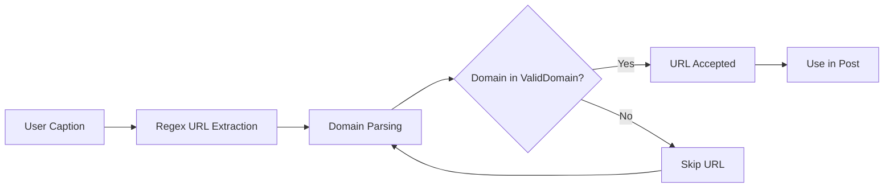

## Overview

The URL validation system ensures that only legitimate TeraBox URLs are processed and distributed to channels. This prevents spam, malicious links, and invalid content from being posted.

## Validation architecture



## Valid domain list

The system maintains a whitelist of approved TeraBox domains:

```python app.py
ValidDomain = [
  "terabox.com",
  "nephobox.com", 
  "freeterabox.com", 
  "terabox.app",
  "momerybox.com",
  "teraboxapp.com",
  "1024nephobox.com",
  "teraboxlink.com",
  "funpavo.com",
  "1024terabox.com"
  ]
```

### Domain breakdown

<CardGroup cols={2}>
  <Card title="terabox.com" icon="box">
    Official TeraBox domain
  </Card>
  <Card title="nephobox.com" icon="cloud">
    Alternative TeraBox branding
  </Card>
  <Card title="freeterabox.com" icon="gift">
    Free tier TeraBox service
  </Card>
  <Card title="terabox.app" icon="mobile">
    Mobile app domain
  </Card>
  <Card title="momerybox.com" icon="database">
    Regional variant spelling
  </Card>
  <Card title="teraboxapp.com" icon="window">
    Application-specific domain
  </Card>
  <Card title="1024nephobox.com" icon="server">
    Numbered variant (1024 = 1TB)
  </Card>
  <Card title="teraboxlink.com" icon="link">
    Link-sharing specific domain
  </Card>
  <Card title="funpavo.com" icon="bird">
    Partnership/affiliated domain
  </Card>
  <Card title="1024terabox.com" icon="hard-drive">
    Numbered TeraBox variant
  </Card>
</CardGroup>

## URL extraction logic

The validation process occurs in the photo message handler:

```python app.py
TeraUrl = ""
try:
  match = re.findall(r'(https?://[^\s]+)', f"{m.caption}")
  for url in match:
    data = url.split("/")[2]
    if str(data) in ValidDomain:
      TeraUrl+=url
      break
    else:
      continue
except Exception as e:
  print(e)
```

### Step-by-step breakdown

<Steps>
  <Step title="Initialize empty URL">
    ```python
    TeraUrl = ""
    ```
    Start with an empty string to store the validated URL.
  </Step>
  
  <Step title="Extract all URLs with regex">
    ```python
    match = re.findall(r'(https?://[^\s]+)', f"{m.caption}")
    ```
    Find all HTTP/HTTPS URLs in the caption using regex pattern matching.
  </Step>
  
  <Step title="Parse domain from URL">
    ```python
    data = url.split("/")[2]
    ```
    Extract the domain portion by splitting on `/` and taking the third element (index 2).
  </Step>
  
  <Step title="Check against whitelist">
    ```python
    if str(data) in ValidDomain:
      TeraUrl+=url
      break
    ```
    If the domain is in the ValidDomain list, accept it and stop searching.
  </Step>
  
  <Step title="Skip invalid URLs">
    ```python
    else:
      continue
    ```
    If the domain is not valid, continue to the next URL in the caption.
  </Step>
</Steps>

## Regex pattern explained

The regex pattern `r'(https?://[^\s]+)'` breaks down as:

| Component | Meaning |
|-----------|----------|
| `https?` | Match "http" or "https" (the `?` makes the "s" optional) |
| `://` | Match the protocol separator literally |
| `[^\s]+` | Match one or more non-whitespace characters |
| `( )` | Capture group - return the entire matched URL |

<Note>
This pattern matches URLs until it encounters whitespace, effectively capturing complete URLs from the caption.
</Note>

## URL parsing

### Domain extraction

Given a URL like `https://terabox.com/s/1A2B3C4D`, the parsing works as:

```python
url = "https://terabox.com/s/1A2B3C4D"
parts = url.split("/")
# parts = ['https:', '', 'terabox.com', 's', '1A2B3C4D']
domain = parts[2]
# domain = 'terabox.com'
```

### Index reference

<CodeGroup>
```python Index 0
url.split("/")[0]  # 'https:'
```

```python Index 1
url.split("/")[1]  # '' (empty string)
```

```python Index 2
url.split("/")[2]  # 'terabox.com'
```

```python Index 3
url.split("/")[3]  # 's'
```

```python Index 4
url.split("/")[4]  # '1A2B3C4D'
```
</CodeGroup>

## First match only

The system uses `break` to accept only the first valid URL:

```python
if str(data) in ValidDomain:
  TeraUrl+=url
  break  # Stop after first valid URL
```

<Warning>
If a caption contains multiple TeraBox URLs, only the first valid one will be used.
</Warning>

## Error handling

The entire validation process is wrapped in error handling:

```python
try:
  # URL extraction and validation
except Exception as e:
  print(e)
```

If any error occurs:
- The exception is printed to console
- `TeraUrl` remains empty
- The post continues with an empty URL field

<Info>
Posts with invalid or missing URLs will still be distributed but without functional download links.
</Info>

## Usage in post formatting

The validated URL is used twice in the post template:

```python app.py
FData = PostText.format(OcaptionTitle,TeraUrl,TeraUrl,GENERALCHANNEL)
```

The template shows the URL in two places:

```python config.py
PostText ="""<b>{}🥰
  
{}
{}
  
🛑Login to watch full video🛑
━━━━━━━━━━━━━━━━━━━━━
✅ ᴊᴏɪɴ ɴᴏᴡ ꜰᴏʀ ᴍᴏʀᴇ ᴠɪᴅᴇᴏꜱ!
{}
  </b>"""
```

Parameters:
1. Title
2. **TeraBox URL (first instance)**
3. **TeraBox URL (second instance)**
4. General channel link

## Common URL formats

### Standard share links

```
https://terabox.com/s/1A2B3C4D5E6F
https://nephobox.com/s/1A2B3C4D5E6F
https://freeterabox.com/s/1A2B3C4D5E6F
```

### App-specific links

```
https://terabox.app/s/1A2B3C4D5E6F
https://teraboxapp.com/s/1A2B3C4D5E6F
```

### Regional variants

```
https://1024terabox.com/s/1A2B3C4D5E6F
https://1024nephobox.com/s/1A2B3C4D5E6F
```

## Edge cases

<AccordionGroup>
  <Accordion title="Multiple URLs in caption">
    Only the first valid TeraBox URL is extracted and used.
    
    ```
    Caption: "Check out https://example.com and https://terabox.com/s/123"
    Result: https://terabox.com/s/123
    ```
  </Accordion>
  
  <Accordion title="No valid URLs">
    If no valid URLs are found, `TeraUrl` remains empty and the post is created without a download link.
    
    ```
    Caption: "Great content! https://example.com"
    Result: TeraUrl = ""
    ```
  </Accordion>
  
  <Accordion title="Subdomain variations">
    The validation only checks the main domain, so subdomains are accepted:
    
    ```
    https://www.terabox.com/s/123  ✓ Valid
    https://share.terabox.com/s/123  ✓ Valid
    ```
    
    However, this could be a security risk.
  </Accordion>
  
  <Accordion title="URL parameters">
    URLs with query parameters are fully captured:
    
    ```
    https://terabox.com/s/123?foo=bar  ✓ Captured completely
    ```
  </Accordion>
</AccordionGroup>

## Security considerations

### Domain spoofing vulnerability

The current implementation has a potential vulnerability:

```python
data = url.split("/")[2]
if str(data) in ValidDomain:
```

This checks if the domain contains the valid domain string, but doesn't ensure exact match. For example:

<Warning>
`https://terabox.com.evil.com/malware` would pass validation because `terabox.com.evil.com`.split("/")[2] contains characters from the domain.

Consider using exact string matching or proper URL parsing libraries.
</Warning>

### Recommended improvement

```python
from urllib.parse import urlparse

parsed = urlparse(url)
domain = parsed.netloc
if domain in ValidDomain:
    TeraUrl = url
    break
```

## Adding new domains

To add new valid domains:

1. Edit `app.py`
2. Add the domain to the `ValidDomain` list:

```python
ValidDomain = [
  "terabox.com",
  "nephobox.com",
  # ... existing domains ...
  "newdomain.com"  # Add here
]
```

3. Restart the bot

<Tip>
Test new domains thoroughly before adding them to production to ensure they're legitimate TeraBox services.
</Tip>

## Validation testing

Test the validation with different URL formats:

```python
test_urls = [
    "https://terabox.com/s/test123",  # Should pass
    "https://example.com/file",       # Should fail
    "http://nephobox.com/s/abc",      # Should pass
    "terabox.com/s/noprotocol",       # Should fail (no http/https)
]
```

## Best practices

<CardGroup cols={2}>
  <Card title="Always include protocol" icon="shield-check">
    Ensure URLs start with `http://` or `https://`
  </Card>
  <Card title="Avoid URL shorteners" icon="link-slash">
    Don't use bit.ly, tinyurl, etc. as they bypass validation
  </Card>
  <Card title="One URL per post" icon="1">
    Include only one TeraBox URL in the caption
  </Card>
  <Card title="Clean URLs" icon="broom">
    Remove tracking parameters and unnecessary query strings
  </Card>
</CardGroup>